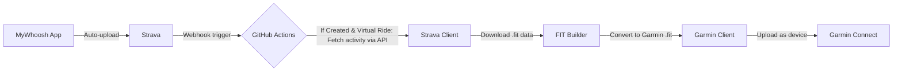

# MyWhoosh2Garmin

> **Automated Strava-to-Garmin Sync for MyWhoosh Activities**
>
> Zero manual steps. Just ride, and your training effect appears on Garmin Connect automatically.

## 🎯 What This Does

This project automatically syncs your MyWhoosh virtual cycling activities from Strava to Garmin Connect as `.fit` files, ensuring they're recognized as Garmin device uploads. This is crucial for having your **training effect** properly reflected in your **Garmin Training Readiness** and **Preparation Score**.

### The Problem This Solves

The original [forked project](https://github.com/OriginalRepo/MyWhoosh2Garmin) required multiple manual steps:
- 📁 Manually downloading `.fit` files from MyWhoosh website
- 🔧 Applying transformations to fix power/heart rate averages
- 🌡️ Removing temperature data
- 📤 Manually uploading to Garmin Connect

**This was tedious and error-prone.** Big training sessions weren't impacting training preparation scores because manual uploads were missed.

### The Solution

This fully automated workflow:
- ✅ **Zero manual steps** — runs completely in the cloud via GitHub Actions
- ✅ **Automatic detection** — finds new MyWhoosh activities on Strava
- ✅ **Smart filtering** — only uploads activities not already on Garmin Connect
- ✅ **Training effect preserved** — `.fit` files recognized as Garmin device uploads
- ✅ **Webhook support** — optional instant sync when you upload to Strava

## 🏗️ Architecture



### Key Components Reused

- **Garmin Client** ([garth](https://github.com/matin/garth)) — handles authentication and upload
- **FIT Builder** ([fit_tool](https://bitbucket.org/stagescycling/fit_tool/src/main/)) — converts Strava JSON to Garmin-compatible `.fit`
- **Strava API** — OAuth2 authentication and activity download

## 🚀 Quick Start

> **📖 For detailed step-by-step instructions, see [SETUP.md](SETUP.md)**

### Prerequisites

- **GitHub account** (for running GitHub Actions)
- **Strava account** with MyWhoosh activities auto-uploaded
- **Garmin Connect account**
- **Strava API application** ([create one here](https://www.strava.com/settings/api))

### 1️⃣ Repository Setup

1. **Fork this repository** or clone it to your GitHub account
2. **Enable GitHub Actions** in your repository settings

### 2️⃣ Authentication Setup

#### Garmin Authentication

Run the Garmin setup script locally to authenticate and generate tokens:

```bash
# Clone the repo
git clone https://github.com/YourUsername/MyWhoosh2Garmin.git
cd MyWhoosh2Garmin

# Install dependencies
pip install uv
uv venv
source .venv/bin/activate  # On Windows: .venv\Scripts\activate
uv pip install -r pyproject.toml

# Run Garmin authentication
python garmin/utils.py
```

You'll be prompted for:
- Garmin username (email)
- Garmin password
- **2FA code** (if enabled)

The script will output a `GARMIN_TOKENS` string — **save this securely!**

#### Strava Authentication

Run the Strava setup script to initialize OAuth tokens:

```bash
python strava/client.py
```

Follow the prompts:
1. Click the authorization URL that appears
2. Authorize the application
3. Copy the callback URL from your browser
4. Paste it back into the terminal

This creates `strava_tokens.json` with your access/refresh tokens.

### 3️⃣ Configure GitHub Secrets

Go to your repository → **Settings** → **Secrets and variables** → **Actions** → **New repository secret**

Add the following secrets:

| Secret Name | Description | Where to Find |
|-------------|-------------|---------------|
| `STRAVA_CLIENT_ID` | Your Strava API application ID | [Strava API Settings](https://www.strava.com/settings/api) |
| `STRAVA_CLIENT_SECRET` | Your Strava API secret | [Strava API Settings](https://www.strava.com/settings/api) |
| `STRAVA_ACCESS_TOKEN` | OAuth access token | From `strava_tokens.json` after setup |
| `STRAVA_EXPIRES_AT` | Token expiration timestamp | From `strava_tokens.json` |
| `STRAVA_EXPIRES_IN` | Token expiration duration | From `strava_tokens.json` |
| `STRAVA_REFRESH_TOKEN` | OAuth refresh token | From `strava_tokens.json` |
| `GARMIN_TOKENS` | Garmin authentication tokens | From `garmin/utils.py` output |

### 4️⃣ Run the Workflow

#### Manual Trigger

Go to **Actions** → **Self-hosted runner — Run MyWhoosh2Garmin** → **Run workflow**

That's it! The workflow will:
1. Fetch your last 7 days of Garmin virtual cycling activities
2. Check Strava for MyWhoosh activities
3. Download new activities not on Garmin
4. Convert to `.fit` format
5. Upload to Garmin Connect

#### Automatic Webhook Trigger (Optional)

For **instant sync** after every Strava upload, set up a webhook using my [WebhookProcessor](https://github.com/MarcChen/WebhookProcessor):

1. Deploy the WebhookProcessor to handle Strava webhook events
2. Configure it to trigger your GitHub Actions workflow
3. Register the webhook URL with Strava

Now every MyWhoosh activity uploaded to Strava will automatically sync to Garmin within minutes! ⚡

## 📋 Environment Variables

The following environment variables are required for the complete workflow:

```bash
# Strava OAuth credentials
STRAVA_CLIENT_ID="12345"
STRAVA_CLIENT_SECRET="your_strava_client_secret"
STRAVA_ACCESS_TOKEN="your_strava_access_token"
STRAVA_EXPIRES_AT="1234567890"
STRAVA_EXPIRES_IN="21600"
STRAVA_REFRESH_TOKEN="your_strava_refresh_token"

# Garmin authentication (from garth client)
GARMIN_TOKENS="your_garmin_tokens_string"
```

> **Note:** For local development, copy `.env-template` to `.env` and fill in your values.

## 🛠️ How It Works

### Workflow Steps

1. **Authentication**
   - Garmin: Uses pre-authenticated tokens from `GARMIN_TOKENS`
   - Strava: Uses OAuth2 with automatic token refresh

2. **Activity Discovery**
   - Fetches last 7 days of virtual cycling activities from Garmin Connect
   - Fetches recent MyWhoosh activities from Strava (filtered by name containing "MyWhoosh")

3. **Smart Filtering**
   - Compares Strava and Garmin activities by start time
   - Only processes activities not already on Garmin

4. **Data Conversion**
   - Downloads Strava activity data (metadata + streams: power, heart rate, cadence, etc.)
   - Builds Garmin-compatible `.fit` file using `fit_tool`

5. **Upload**
   - Uploads `.fit` file to Garmin Connect using `garth` client
   - File is recognized as a Garmin device upload (triggers training effect)

### Database Tracking

The workflow uses SQLite (`strava.db`) to track downloaded activities and prevent duplicate processing.

## 🔒 Security Notes

- ⚠️ **Never commit** `.env` or token files to version control
- 🔐 Store all credentials as **GitHub Secrets**
- 🔄 Tokens are automatically refreshed when expired
- 🗑️ Processed `.fit` files are deleted after upload

## 📦 Dependencies

- **Python 3.13+**
- **uv** (package manager)
- Key libraries:
  - `garth` — Garmin Connect API client
  - `pydantic` / `pydantic-settings` — configuration management
  - `requests` — HTTP client
  - `fit_tool` — FIT file manipulation

## 🤝 Contributing

Feel free to open issues or pull requests! This project is a personal automation tool, but improvements are welcome.

## 📄 License

[GPL-3.0 License](LICENSE)

## 🙏 Acknowledgments

- Original inspiration from [MyWhoosh2Garmin](https://github.com/OriginalRepo/MyWhoosh2Garmin)
- [matin/garth](https://github.com/matin/garth) for excellent Garmin API client
- [fit_tool](https://bitbucket.org/stagescycling/fit_tool/src/main/) for FIT file utilities
- Strava API for activity data access

---

**Made with ❤️ for cyclists who want their training data to just work.**
